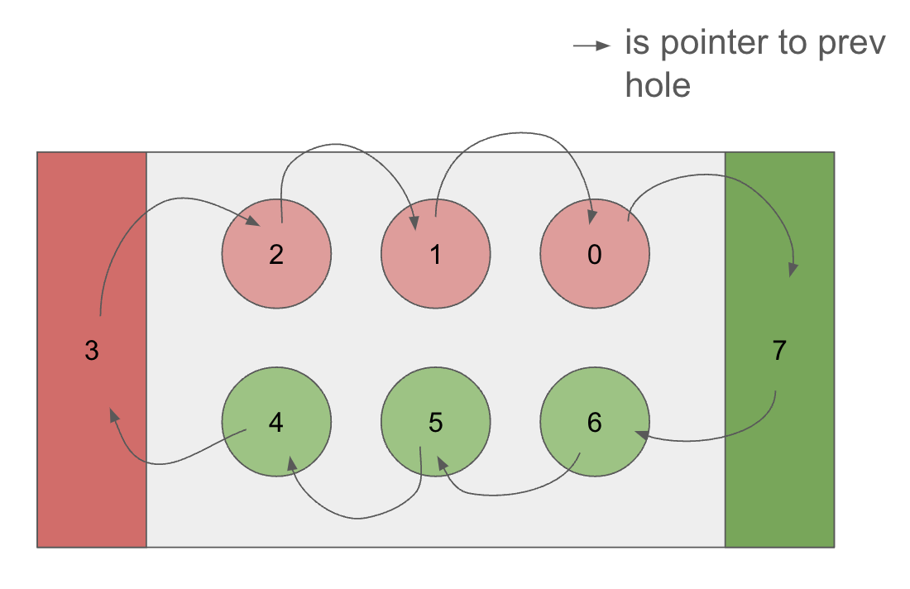
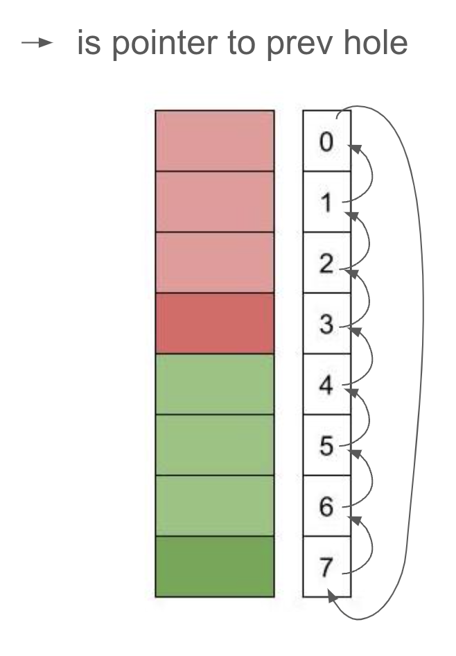
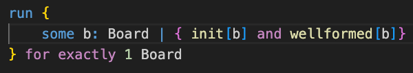
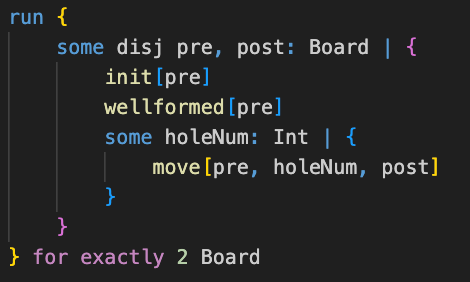
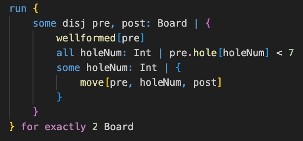
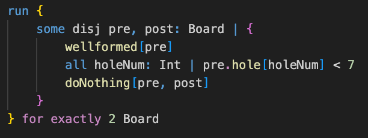
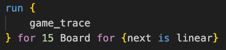
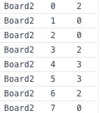
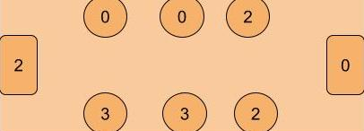

## Part 1: Project Objective

The game we chose to model is Mancala, a two-player board game. We chose to model this game because we think the game is pretty fun and we were curious to see how long a typical game goes on for before somebody wins.

### Setup

- The Mancala board consists of two rows, each with six holes. (In our version, we have two rows of three holes.)
- At the start of the game, four marbles are placed in each of the twelve holes. (In our version, we have two marbles in each hole.)
- Each player has a Mancala (a large collecting hole) on their side of the board.

### Objective

- The aim is to collect as many marbles in your Mancala as possible. The player with the most marbles in their Mancala at the end of the game wins.

### How to Play

- Mancala has so many different versions. Here's how to play our version:
  1. **Starting the Game**: The game begins with one player picking up all the marbles from any hole on their side of the board.
  2. **Marble Movement**: Players can only pick marbles from a hole on their side. Moving counterclockwise, the player places one marble in each hole, including their own Mancala, but not in their opponent's Mancala. If you reach your opponent's Mancala, skip it and continue to the next hole.
  3. **Extra Turn**: If the last marble you placed is in your own Mancala, you earn another turn.
  4. **Changing Turns**: If the last marble is not placed in your Mancala, it becomes the opponent's turn.

### Game End

- The game ends when all holes on one side of the board are empty. The player with the most marbles in their Mancala is declared the winner.

## Part 2: Model Design and Visualization

### a. **Model Design Choices:**

- #### Board

  1. ##### **Simplified Board Representation:**

     Rather than modeling the board as two distinct rows, the model abstracts it into a numbered cycle. On the left is what the board might look like, and on the right is the simplified representation (where the arrows indicate the previous holes):

     - Holes numbered 0 through 2 are designated for Player 1.
     - Holes numbered 4 through 6 are for Player 2.
     - Hole 3 serves as Player 1’s Mancala, and Hole 7 as Player 2’s Mancala.

      
      

     Left: what the physical board would look like

     Right: how we represent the model (we only care about the hole numbers and their order, not the actual shape of the board)

  2. ##### Board fields
     We chose to have our board store the player’s turn, the order of the holes, and the number of marbles in each hole.
     We stored it all in board because each board represents a new move, and so we can easily access the information we need when making a move from the previous to post board.
     We chose to have the prev function so we can compare a hole’s marbles with its previous hole (which is useful for when we needed to check for the last marble played in a move, and for when we need to ensure marbles are moved in one direction only).

- #### Holes

  1. ##### **Reducing the Number of Holes**

     In traditional Mancala, the board consists of two rows with six holes each, plus two Mancalas (one for each player) on opposite ends.
     For simplification, our model reduces the total number of holes to six, with three holes allocated for each player.

  2. ##### **No Marble or Hole Sig**
     We chose not to have a separate Sig for marbles because we figured all marbles are the same, so we only care about the number of them in each hole, and can therefore represent them as integers.
     We chose not to have a hole Sig because we only cared about how many marbles were in the hole, which could more easily be represented as a pfunc (mapping hole number to number of marbles), within our Board.

- #### Move
  1. ##### **What counts as a move**
     We chose to model a move by forcing the starting hole to be empty after a move is made, and forcing the number of holes whose marbles have increased to be equal to the number of marbles in the starting hole. This prevents a player from making a move that wraps around the board in a full circle. We chose to do this because in a realistic, full scale game, we never really encounter this case, and it is not strategic to allow that many marbles to pile up into one hole (considering that it gives the other player a lot of marbles on their side, and only contributes 1 to the mancala). In doing this, we avoided a scenario where we would need more than 7 marbles, which solves the bitwidth limitation (since we represented marbles as integers).
  2. ##### **How we get the move to be made in the correct order**
     Since our holes are numbered 0-7, and each hole is linked to its previous hole via prev, we checked that if any hole got a new marble, it's previous hole must have gotten a new one too (to ensure the player is not scattering marbles at random). The exception to this is when the previous hole is the other player's mancala or the starting hole (in which case it is okay for the hole to get a new marble since these specific previous holes should not be getting a new marble). One last check is made to ensure that the hole next to the other player's mancala only gets a new marble if the hole previous to the other mancala also got one (hence, a successful 'skipover').

### b. Run Statements

- To check for a well-formed initial board, we had separate run statements for both `wellformed` and `init`, and then one together to make sure that a well-formed initial board is what we expect.

  - 

- To check for valid first moves, we ran `move` with a well-formed initial pre-board.
  - 
- To check for valid moves, we ran `move` with a well-formed pre-board (with fewer than 7 marbles, a property that holds for our model without being constrained explicitly).

  - 

- To check for valid do-nothings, we ran `doNothing` with a well-formed pre-board.

  - 

- To check for valid games (with valid moves made on each board), we ran `game_trace`.
  - 

### c. Visualizer

- We don't have a custom visualizer because we felt the defualt was sufficient. The only trouble may be picturing which hole goes where, but we included the diagram above to make it easier.
- Instead of using the graph to understand our model, which is clustered and hard to read, it is best to use the table. When you click on 'Table,' you will see five main tables: hole, turn, prev, next, and first. 'Prev' represents the order of the holes, which should stay the same for every board so it's not super important to look at. 'First' represents the starting board, and 'next' indicates the order of the boards (which goes in ascending order). We recommend primarily looking at the table labeled 'hole' to see how the board updates after players make a move, as well as 'turn' to see who is making the move that leads to the next board.
- Here is how to interpret an instance of the board in the hole table:

  - 
  - 

    The first integer column is the hole number and the second integer column is the number of marbles. The bottom diagram shows how many marbles are in each hole. To match the hole number to where it is located in the physical board, see the diagrams in Part 2. 

    Note: In the turn table, you would either see [Board2 Player10] or [Board2 Player20]. [Board2 Player10] would mean that the board after Board2 will represent Player1's move. [Board2 Player20] means the next board represents Player 2's move.

## Part 3: Signatures and Predicates

### Signatures

In our model, we used the following three signatures: Game, Board, and Player. We have one Game which consists of multiple boards (with each Board representing a new move made and tracking whose turn it is), and two players (Player1 vs. Player2). We needed Game to keep track of the order of boards, we needed Board to keep track of moves and turns, and we needed Player to distinguish between Player1 and Player2.

- Game:
  - This signature represents the entire game. Its first field will point to the initial board (where two marbles are in each hole, and the mancalas are empty). The next field provides the order of boards, which can be thought of as the order of moves made.
- Board:
  - This signature represents the Mancala board. For simplification purposes, we modeled it as a numbered cycle. It consists of 8 slots in total, which include 6 holes and two Mancalas. Please see above for a visual representation of the board. The Board's fields allow it to keep track of the order of the holes (to ensure movement in one direction), the player turn, and the number of marbles in each hole.
- Player:
  - We have an abstract player signature, which is extended by Player 1 and Player 2. Since Mancala is a two-player game, we only needed to model two players. We made this sig so we would know whose turn it is for any board.

### Predicates

Here are the main predicates in our model. In the context of the game, the predicates init and wellformed ensure the gameboard is set up properly. The predicates move and doNothing represent a transition from one board to another (an action a player can take). The predicate game_trace models the entire game from the starting board to the next boards after that. It calls wellformed and init on the first board, and does move or doNothing for the transitions to the next board.

- pred init
  - This predicate defines the conditions for what the initial board of Mancala should look like.
- pred wellformed:
  - This predicate establishes the constraints needed to have a well-formed Mancala board at all times. A well-formed Mancala board has exactly 8 holes, numbered 0 through 7. Each hole has exactly one previous hole, and the number of marbles per hole is not negative.
- pred move:
  - Sets up the guards that should be in place in order to make a move. This includes checking that the game is not over, that it is the correct player's turn, and that the move location is valid.
  - It then defines the consequences of making a move, which includes updating the number of marbles in the holes where the player placed a marble and switching turns if necessary.
  - It also forces everything else about the board (like the order of the holes, the number of marbles in the other unused holes) to remain unchanged.
- pred doNothing:
  - When a game is over, which only happens if either player has won, this predicate enforces that everything on the board remains unchanged.
- pred game_trace:
  - Represents a game from start to end. Each move is a transition from one board (pre: the board before the move) to another board (post: the board after the move).

## Part 4: Testing

- Our testing strategy involved writing tests for every predicate, as well as tests for the opposite (not predicate). For example, for every predicate, we use assert statements to check that each expected property is necessary for the predicate, some other properties are sufficient (to ensure we're not over constraining), and some properties are sufficient for violating the predicate. We also use some test expect blocks to check that the predicates are satisfiable by themselves, and in combination with other predicates. We also check for unsatisfiable cases to ensure that we are not under constraining. We made a game_trace predicate that we could use to test properties that should hold for the entire game.
- Some of the things we tested were that the game starts with evenly distributed marbles in non-mancala holes, a player makes a move only on their turn and is able to make a proper move (taking marbles from the starting pile, and distributing them in the correct direction while skipping the other player’s mancala), a player only does nothing when the game is over, when the game is over the board stays the same, and the board switches turns depending on where the last marble is placed. More specifics can be found in the comments in our test file.
- To verify our model, we also used induction (included in the “induction” section of our test suite). This involved a test checking that given a wellformed initial board, then after a transition, the post-board is also wellformed. In addition, we checked that from any wellformed board (not just the initial one), a transition will preserve the well formed property. These two tests prove that if we start with a wellformed board, all boards in the game will be wellformed.

## Part 5: Documentation

### Takeaways

We learned that, given the simplification of Mancala, the game finishes rather quickly. Most times (not all), the game is over in fewer than 15 boards (around 10, but occasionally more than that). By observing our game traces, we also learned that it's a bad strategy to let too many marbles collect on your side, because the other player's side is almost empty and the game is nearly over, so you would have fewer marbles in your own mancala. We were curious to see if any player had an unseen advantage, but the outcomes seem pretty consistent between either player winning. We did not see ties as often, which is to be expected considering those ones usually emerge from longer traces.
In terms of modeling, we learned how difficult it is to try to get things to scale, especially when working with a limited range of integers. We also learned that some design choices may make more sense in terms of mental models, like having separate classes for each item, but may not be as functional to the model because of less efficient access. In terms of testing, we realized how important it was to go step by step, so that when something goes wrong, you know exactly what’s causing the issue, and where to look in the code. We also had an easier time looking at counterexamples shown by the Sterling visualizer due to how many times we had to look at it to debug. If we were to expand on this idea, we might add some additional rules that other versions of Mancala have (like allowing a player to 'capture' the other player's marbles if the last marble lands in an empty hole). It might also be cool to see what would happen if we allow a player to repeat a turn if they land in a non-empty hole.
