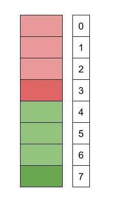

## Part 1: Project Objective
The game we chose to  modele is Mancala, a two-player board game.

### Setup
- The Mancala board consists of two rows, each with six holes.
- At the start of the game, four marbles are placed in each of the twelve holes.
- Each player has a Mancala (a large collecting hole) on their side of the board.

### Objective
- The aim is to collect as many marbles in your Mancala as possible. The player with the most marbles in their Mancala at the end of the game wins.

### How to Play
- Mancala has so many different versions. Here's how to play our version:
  1. **Starting the Game**: The game begins with one player picking up all the marbles from any hole on their side of the board.
  2. **Marble Movement**: Players can only pick marbles from holes on their side. Moving counterclockwise, the player places one marble in each hole, including their own Mancala, but not in their opponent's Mancala. If you reach your opponent's Mancala, skip it and continue to the next hole on your side.
  3. **Extra Turn**: If the last marble you placed is in your own Mancala, you earn another turn.
  4. **Changing Turns**: If the last marble is not placed in your Mancala, it becomes the opponent's turn.

### Game End
- The game ends when all six holes on one side of the board are empty. The player with the most marbles in their Mancala is declared the winner.
## Part 2: Model Design and Visualization
### a. **Model Design Choices:**
- #### Board
  1. ##### **Simplified Board Representation:**
    Rather than modeling the board as two distinct rows, the model abstracts it into a linear sequence, or "stack." Here is the simplified representation:
     - Holes numbered 0 through 2 are designated for Player 1.
     - Holes numbered 4 through 6 are for Player 2.
     - Hole 3 serves as Player 1’s Mancala, and Hole 7 as Player 2’s Mancala.

  

  2. ##### Board fields
  We chose to have our board store the player’s turn, the order of the holes, and the number of marbles in each hole.
  We stored it all in board because each board represents a new move, and so we can easily access the information we need when making a move from the previous to post board.
  We chose to have the prev function so we can compare a hole’s marbles with its previous hole (which is useful for when we needed to check for the last marble played in a move).

- #### Holes
  1. ##### **Reducing the Number of Holes**
  In traditional Mancala, the board consists of two rows with six holes each, plus two Mancalas (one for each player) on opposite ends. 
  For simplification, our model reduces the total number of holes to six, with three holes allocated for each player. 

  2. ##### **No Marble or Hole Sig**
  We chose not to have a separate Sig for marbles because we figured all marbles are the same, so we only care about the number of them in each hole, and can therefore represent them as integers. 
  We chose not to have a hole Sig because we only cared about how many marbles were in the hole, which could more easily be represented as a pfunc (mapping hole number to number of marbles), within our Board.

### b. Run Statements

- To check for a well-formed initial board, we had separate run statements for both `wellformed` and `init`, and then one together to make sure that a well-formed initial board is what we expect.
  
- 

- To check for valid first moves, we ran `move` with a well-formed initial pre-board.
  
- 
- To check for valid moves, we ran `move` with a well-formed pre-board (with fewer than 7 marbles, a property that holds for our model without being constrained explicitly).
  
- 
- To check for valid do-nothings, we ran `doNothing` with a well-formed pre-board.
 
- 
- To check for valid games (with valid moves made on each board), we ran `game_trace`.
 
- 
### c. visualizer
- We don't have a visualizer because the process of creating one was a bit complicated and time-consuming, and we also realized that we didn't need one
- Instead of using the graph to understand our model, it is best to use the table. When you click on 'Table,' you will see five main tables: hole, turn, prev, next, and first. We recommend just looking at the table labeled 'hole' to see how the board updates after players make a move.
- Here is how to interpret an instance of the board in the hole table:
  - 
  - 
## Part 3: Signatures and Predicates
### Signatures
In our model, we used the following two signatures:
- Board:
  - This signature represents the Mancala board. For simplification purposes, we modeled it as a "stack". It consists of 8 slots in total, which include 6 holes and two Mancalas. Please see above for a visual representation of the board.
- Player:
  - We have an abstract player signature, which is extended by Player 1 and Player 2. Since Mancala is a two-player game, we only needed to model two players.
### Predicates
Here are the main predicates in our model:
- pred init
  - This predicate defines the conditions for what the initial board of Mancala should look like.
- pred wellformed:
  - This predicate establishes the constraints needed to have a well-formed Mancala board at all times. A well-formed Mancala board has exactly 8 holes, numbered 0 through 7. Each hole has exactly one previous hole, and the number of marbles per hole is not negative.
- pred move:
  - Sets up the guards that should be in place in order to make a move. This includes checking that the game is not over, that it is the correct player's turn, and that the move location is valid.
  - It then defines the consequences of making a move, which includes updating the number of marbles in the holes where the player placed a marble and switching turns if necessary.
- pred doNothing:
  - When a game is over, which only happens if either player has won, this predicate enforces that everything on the board remains unchanged.
- game_trace:
  - Represents a game from start to end. Each move is a transition from one board (pre: the board before the move) to another board (post: the board after the move).

## Part 4: Testing
- Our testing strategy involved writing tests for every predicate, as well as tests for the opposite (not predicate). For example, for every predicate, we use assert statements to check that each expected property is necessary for the predicate, some other properties are sufficient, and some properties are sufficient for violating the predicate. We also use some test expect blocks to check that the predicates are satisfiable by themselves, and in combination with other predicates. We also check for unsatisfiable cases to ensure that we are not under constraining. We made a game_trace predicate that we could use to test properties that should hold for the entire game.
- Some of the things we tested were that the game starts with evenly distributed marbles, a player makes a move only on their turn and is able to make a proper move (taking marbles from the starting pile, and distributing them in the correct direction while skipping the other player’s mancala), a player only does nothing when the game is over, and the board switches turns depending on where the last marble is placed. More specifics can be found in the comments in our test file.
- To verify our model, we also used induction (included in the “induction” section of our test suite). This involved a test checking that given a wellformed initial board, then after a transition, the post-board is also wellformed. In addition, we checked that from any wellformed board (not just the initial one), a transition will preserve the well formed property. These two tests prove that if we start with a wellformed board, all boards in the game will be wellformed.

## Part 5: Documentation
Done!