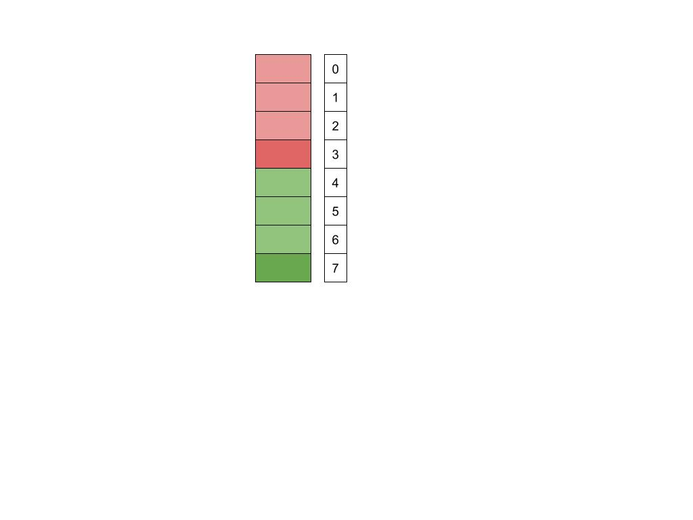

## Part 1: Game Info
The game we chose to  modele is Mancala, a two-player board game.

### Setup
- The Mancala board consists of two rows, each with six holes.
- At the start of the game, four marbles are placed in each of the twelve holes.
- Each player has a Mancala (a large collecting hole) on their side of the board.

### Objective
- The aim is to collect as many marbles in your Mancala as possible. The player with the most marbles in their Mancala at the end of the game wins.

### How to Play
- Mancala has so many different versions. Here's how to play our version:
  1. **Starting the Game**: The game begins with one player picking up all the marbles from any hole on their side of the board.
  2. **Marble Movement**: Players can only pick marbles from holes on their side. Moving counterclockwise, the player places one marble in each hole, including their own Mancala, but not in their opponent's Mancala. If you reach your opponent's Mancala, skip it and continue to the next hole on your side.
  3. **Extra Turn**: If the last marble you placed is in your own Mancala, you earn another turn.
  4. **Changing Turns**: If the last marble is not placed in your Mancala, it becomes the opponent's turn.

### Game End
- The game ends when all six holes on one side of the board are empty. The player with the most marbles in their Mancala is declared the winner.
## Part 2: Parts of the Mancala game that have been Partially Abstracted or Simplified

### Reducing number of Holes
In traditional Mancala, the board consists of two rows with six holes each, plus two Mancalas (one for each player) on opposite ends. 
For simplification, our model reduces the total number of holes to six, with three holes allocated for each player. 

### Simplified Board Representation
Rather than modeling the board as two distinct rows, the model abstracts it into a linear sequence, or "stack." Here is the simplified representation:
- Holes numbered 0 through 2 are designated for Player 1.
- Holes numbered 4 through 6 are for Player 2.
- Hole 3 serves as Player 1’s Mancala, and Hole 7 as Player 2’s Mancala.

### Reasons for Simplification
- A smaller board with fewer holes simplifies the logic required to the model game dynamics, making it easier to develop and test predicates that simulate gameplay.

## Part 3: Takeaways

## Part 4: How to run it and how to read the table